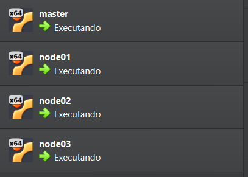
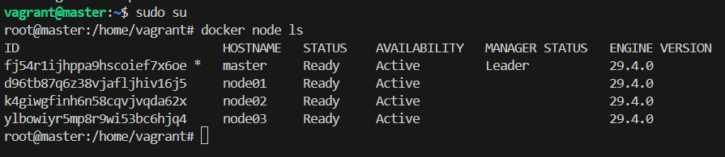

# Desafio DIO - Definição de um Cluster Swarm Local com o Vagrant 🐳

Este repositório contém a resolução do desafio **"Definição de um Cluster Swarm Local com o Vagrant"** da formação [Docker Fundamentals](https://www.dio.me/curso-docker) da DIO.

Este projeto demonstra a criação e configuração automatizada de um **Cluster Docker Swarm** local utilizando **Vagrant** e **VirtualBox**. O objetivo é provisionar uma infraestrutura escalável com um nó gerenciador (Master) e três nós trabalhadores (Workers), garantindo que todos possuam o Docker pré-instalado e configurado.

---

## 🏗️ Arquitetura do Cluster

A infraestrutura é composta por 4 máquinas virtuais Ubuntu 24.04, configuradas com IPs fixos em uma rede privada:

| Máquina    | Função  | IP Fixo          | Memória | CPU  |
| :--------- | :------ | :--------------- | :------ | :--- |
| **master** | Manager | `192.168.56.100` | 1024MB  | 1    |
| **node01** | Worker  | `192.168.56.101` | 1024MB  | 1    |
| **node02** | Worker  | `192.168.56.102` | 1024MB  | 1    |
| **node03** | Worker  | `192.168.56.103` | 1024MB  | 1    |

---

## 🧠 Desafios Encontrados e Soluções

Durante a implementação, alguns desafios técnicos foram superados para garantir a estabilidade do cluster:

### 1. Conflito e Isolamento de Rede
- **Problema:** Colisão entre a rede padrão do Vagrant (`10.0.0.x`) e a rede física local, resultando em erros de "Host Unreachable".
- **Solução:** Migramos todo o cluster para a faixa `192.168.56.x`, que é o padrão estável para redes *Host-Only* no VirtualBox, garantindo que os nós se comuniquem perfeitamente.

### 2. Automação e "Race Conditions" (Corrida de Dados)
- **Problema:** Os nós Workers tentavam entrar no Swarm antes do Master gerar o token ou enquanto o Windows ainda travava o arquivo `worker.sh` para escrita na pasta compartilhada.
- **Solução:** Implementamos um loop de espera (`while`) no provisionamento dos Workers, forçando-os a aguardar a existência e estabilidade do arquivo de token antes de tentar o `join`.

### 3. Segurança e Firewall
- **Problema:** *Timeouts* constantes no comando `docker swarm join`, mesmo com a rede ativa.
- **Solução:** Garantimos a execução do `sudo ufw disable` no topo do script do Master, liberando as portas de gerência do Swarm (2377, 7946 e 4789) antes das tentativas de conexão.

### 4. Falha de Dependência (Node01)
- **Problema:** O nó `node01` ficou fora do cluster inicialmente porque o Docker não foi instalado corretamente (causado por um "lock" do sistema de atualização do Ubuntu no boot).
- **Solução:** Realizamos o provisionamento focado apenas naquele nó (`vagrant provision node01`) e validamos o ingresso manual no cluster.

---

## 🚀 Como Executar

### Pré-requisitos
- [Vagrant](https://www.vagrantup.com/downloads) instalado.
- [VirtualBox](https://www.virtualbox.org/wiki/Downloads) instalado.

### Passo a Passo
1. Clone este repositório.
2. Navegue até a pasta do projeto no terminal.
3. Inicie o provisionamento das máquinas:
   ```bash
   vagrant up
   ```
4. O Vagrant irá:
   - Baixar a imagem base do Ubuntu.
   - Configurar as interfaces de rede.
   - Instalar o Docker e Docker Compose (`docker.sh`).
   - Inicializar o Swarm no Nó Master (`master.sh`).
   - Gerar o token de acesso e incluir automaticamente os Workers no cluster.

---

## 🛠️ Comandos Principais Utilizados

### Vagrant
- `vagrant up`: Cria e configura as máquinas virtuais.
- `vagrant ssh <nome>`: Acessa uma máquina específica (ex: `vagrant ssh master`).
- `vagrant status`: Verifica o estado das máquinas.
- `vagrant destroy -f`: Remove todas as máquinas do projeto.

### Docker Swarm
- `docker swarm init --advertise-addr <IP>`: Inicializa o cluster no nó manager.
- `docker swarm join-token worker`: Gera o comando para novos workers entrarem no cluster.
- `docker swarm join --token <TOKEN> <IP>:2377`: Comando executado nos workers para ingressar no cluster.
- `docker node ls`: Lista todos os nós do cluster (executar no nó Master).

---

## 📸 Evidências do Projeto

### Máquinas em Execução (VirtualBox)
A imagem abaixo mostra as quatro máquinas virtuais (`master`, `node01`, `node02`, `node03`) rodando em segundo plano.



### Status do Cluster Swarm
Aqui podemos visualizar o resultado do comando `docker node ls` dentro do nó Master, confirmando que os 4 nós estão ativos e prontos.



---

## 📝 Notas de Implementação
- **Segurança**: O script `master.sh` desabilita o firewall (`ufw`) para facilitar a comunicação entre os nós na rede privada.
- **Automação**: O `Vagrantfile` utiliza um loop para definir as máquinas e scripts de provisionamento, evitando repetição de código.
- **Sincronização**: Os workers utilizam a pasta compartilhada `/vagrant` para ler o script de join gerado dinamicamente pelo master.
